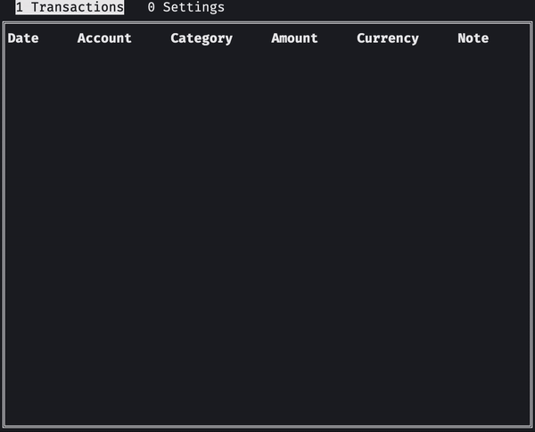

# Gentlemoney

[](https://github.com/kotlw/gentlemoney/blob/main/LICENSE)
[](https://codecov.io/gh/kotlw/gentlemoney)
[](https://goreportcard.com/report/github.com/kotlw/gentlemoney)

Terminal money manager for personal use.
<p align="center">
  
</p>

## Instalation
There are no trix to run this app. Just clone it and run.
```
git clone https://github.com/kotlw/gentlemoney.git
cd gentlemoney
go run ./cmd/gmon
```

## Navigation
Since navigation hints in app is missing here are some description of how to use it. [Tview](https://github.com/rivo/tview) has a bit of predefined bindings which are good such as table navigation using vim bindings ```'h'```, ```'j'```, ```'k'```, ```'l'```. As for others they are more or less intuitive. Here are the list:
 - ```Enter``` - submit
 - ```Esc``` - cancel
 - ```Tab``` - focus next item
 - ```Shift+Tab``` - focus previous item
 - ```c``` - create (transaction/account/currency/category)
 - ```u``` - update
 - ```d``` - delete
